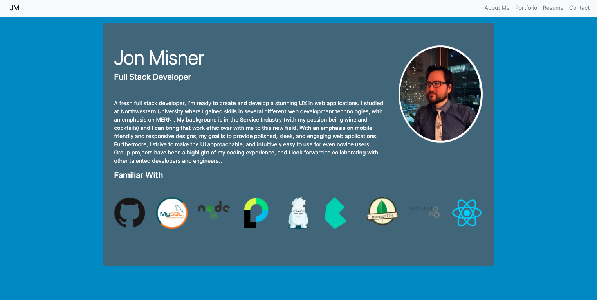
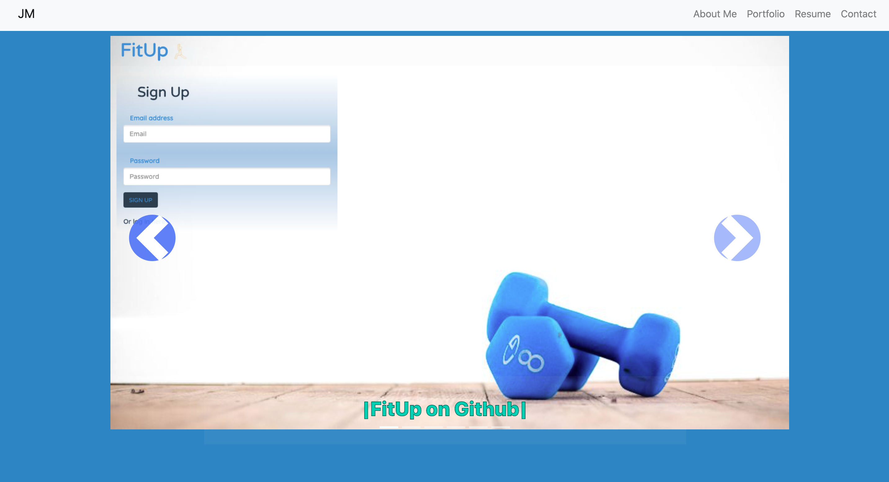
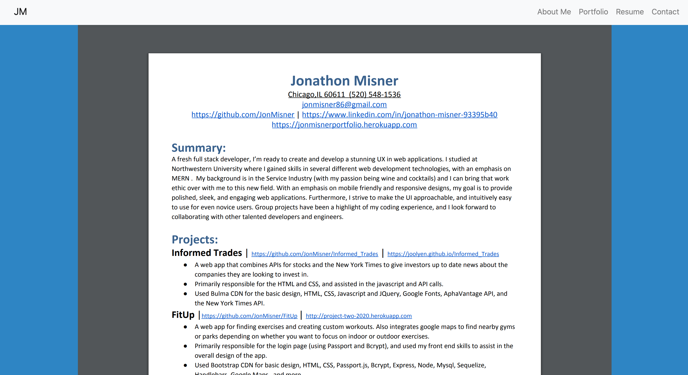
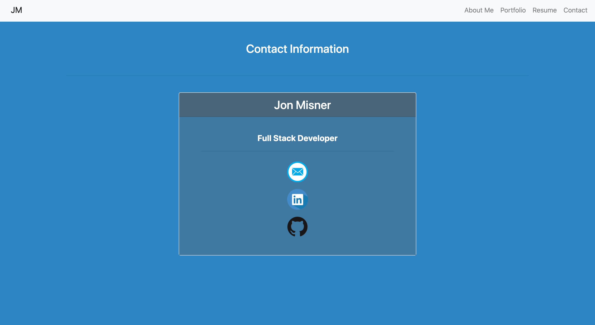

  # Portfolio Using React  
  
***
 
  ## Description

    A portfolio website for Jon Misner using React and Reactstrap
***

  ## Table of Contents

  * [Description](#description)
  * [Installation](#installation)
  * [Usage](#use)
  * [Contributors](#contributors)
  * [Contact Information](#email)
  * [License](#license)
***

***

  ## Installation

    To install necessary dependencies, run the following command:
  
     npm install
***
  ## Usage

     npm start
***
  ## Contributors

     Created By Jon Misner, 
     with help from Kathleen Misner
***
  ## Contact Information

      JonMisner on Github 
      or 
      jonmisner.developer@gmail.com
***
    ### License: MIT
***  
